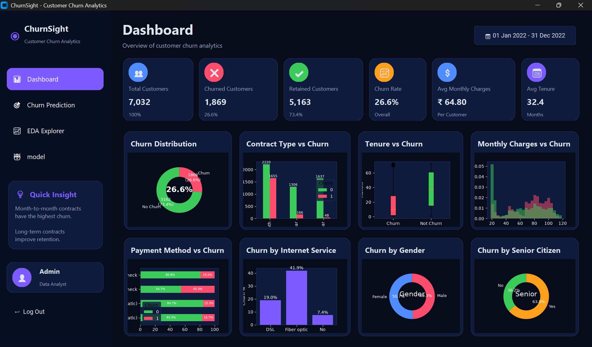
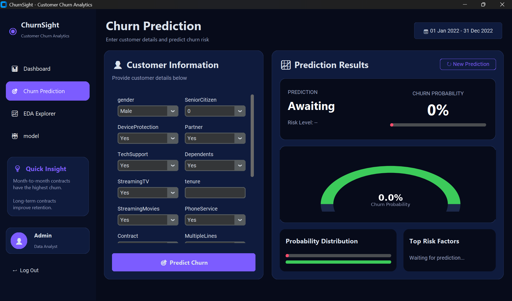
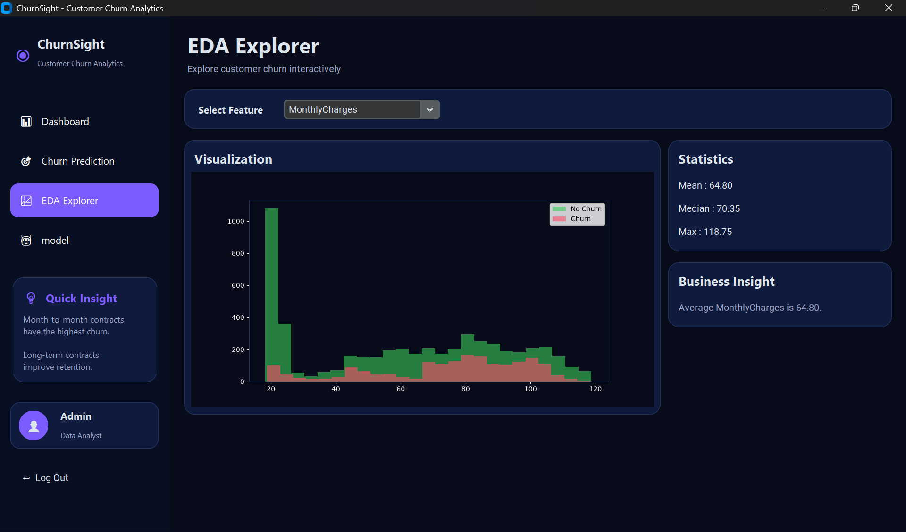

# ChurnSight – Customer Churn Prediction System

A modern desktop application built with **Python, CustomTkinter, and XGBoost** that predicts customer churn and provides interactive analytics through dashboards and visualizations.

## Features

- Executive Dashboard with KPIs
- Customer Churn Prediction
- Churn Risk Percentage
- Low/Medium/High Risk Indicator
- Interactive EDA Explorer
- Business Insights & Analysis
- Model Information Page
- Modern Dark UI

## Screenshots

## Screenshots

### Dashboard



### Churn Prediction



### EDA Explorer



## Tech Stack

- Python
- CustomTkinter
- Pandas
- Matplotlib
- Scikit-learn
- XGBoost
- Joblib

## Project Structure

```text
Customer_Churn_Prediction/
│── app.py
│── requirements.txt
│── README.md
│
├── gui/
│   ├── dashboard.py
│   ├── prediction.py
│   ├── eda.py
│   ├── analysis.py
│   ├── model_info.py
│   └── sidebar.py
│
├── utils/
│   └── predictor.py
│
├── model/
│   ├── final_churn_model.pkl
│   └── scaler.pkl
│
├── dataset/
│   └── churn_clean.csv
